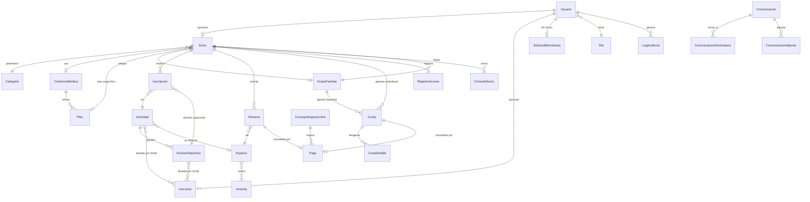

# SPEC.md — Sistema de Gestión Club Atlético Unión (CAU)

**Versión:** 4.0 (Especificación Técnica Consolidada)
**Basado en:** `CAU_Requerimientos_Funcionales_v3.pdf`
**Fecha:** 2026-08-27
**Convención de trazabilidad:** los requerimientos heredados del documento v3 conservan su ID original (`RF-XXX-NN`). Los requerimientos y reglas de negocio nuevos, producto de la auditoría contra el PDF v3, se marcan como **[NUEVO-SPEC]**. Los campos, entidades y reglas detectados en la auditoría visual del diseño de Figma (§7) se marcan como **[NUEVO-SPEC-UI]**. Los campos detectados como faltantes recién al implementar Etapa 1 (no cubiertos por ninguna auditoría previa) se marcan como **[NUEVO-SPEC-IMPL]**.

---

## 1. Visión General y Alcance

### 1.1 Objetivo del sistema

Sistema de gestión integral para el Club Atlético Unión (CAU), que digitaliza la administración de socios, grupos familiares, actividades, reservas de espacios, cobranza de cuotas, comunicaciones institucionales y control de acceso físico, junto con un portal de autogestión para socios y aspirantes a socio.

### 1.2 Fase 1 — Web (Backoffice + Portal del Socio)

Alcance mínimo viable, desplegado como aplicación web responsive:

- Backoffice administrativo (SuperAdmin, Administrador, Empleado/Secretaría, Instructor).
- Portal del Socio (autogestión).
- Portal público + flujo de Solicitud de Membresía para No Socios.
- Integración de pagos con Mercado Pago.
- Comunicaciones por Email y WhatsApp (vía proveedor de mensajería, ej. Twilio/WhatsApp Business API).
- Control de acceso físico mediante QR (portería).

### 1.3 Fase 2 — App del Socio (fuera de alcance de esta especificación, dejado como visión)

- App móvil nativa/híbrida para el Socio, reutilizando la API REST de Fase 1.
- Notificaciones push (vencimientos, confirmaciones, comunicados).
- Carnet digital con QR embebido, validable offline por checksum firmado.
- Reserva de canchas deportivas dentro de la app (si el club decide habilitar ese flujo online más adelante — hoy es explícitamente fuera de plataforma, ver RF-RES-28).

### 1.4 Fuera de alcance (ambas fases, salvo decisión futura del club)

- Pagos parciales / financiación en cuotas de una misma cuota social (**[NUEVO-SPEC]**, ver §3.8).
- Multi-sede / multi-club (tenant único).
- Facturación electrónica / integración AFIP (se emite comprobante interno, no factura fiscal).

---

## 2. Roles y Modelo de Acceso (RBAC)

### 2.1 Roles del sistema

Se extiende el esquema original de 4 roles (RF-LOG-01) a **6 roles**, incorporando Empleado/Secretaría e Instructor como usuarios con login propio **[NUEVO-SPEC]**:

| Rol | Origen | Descripción |
|---|---|---|
| **SuperAdministrador** | RF-LOG-01 | Control total, incluida la gestión de usuarios administrativos y Configuración. |
| **Administrador** | RF-LOG-01 | Todas las funcionalidades administrativas, excepto administración de usuarios administradores y Configuración crítica. |
| **Empleado / Secretaría** | **[NUEVO-SPEC]** | Rol operativo diario: atención al socio, cobranza, reservas, comunicaciones y portería (control de acceso). Sin visibilidad de reportes financieros consolidados ni Configuración. |
| **Instructor** | **[NUEVO-SPEC]** | Usuario con login propio, acceso a un mini-portal donde ve únicamente las actividades que tiene asignadas y sus inscriptos. No accede a datos financieros ni de otros socios fuera de sus actividades. |
| **Socio** | RF-LOG-01 | Portal del Socio únicamente. |
| **No Socio** | RF-LOG-01 | Páginas públicas + solicitud de membresía y su seguimiento. |

**Regla de implementación [NUEVO-SPEC]:** los 6 roles son entidades de datos (`Rol`), no valores hardcodeados, para sostener RF-CONF-08/RF-CONF-09 (el SuperAdmin puede crear roles adicionales y ajustar permisos finos por `Permiso`).

### 2.2 Matriz de permisos por módulo

Convención: **C**=Crear · **L**=Leer · **M**=Modificar · **B**=Baja lógica · **—**=Sin acceso · **Propio**=Solo sobre sus propios registros

| Módulo | SuperAdmin | Administrador | Empleado/Secretaría | Instructor | Socio | No Socio |
|---|:---:|:---:|:---:|:---:|:---:|:---:|
| Socios (ABM) | CLMB | CLMB | CLM (sin B) | — | Propio (L, M parcial) | — |
| Grupos Familiares | CLMB | CLMB | CLM (sin B) | — | Propio (L) | — |
| Actividades (ABM) | CLMB | CLMB | CLM (sin B) | L (propias) | L | L (público) |
| Inscripciones a Actividades | CLMB | CLMB | CLMB | L (propias, sin editar) | Propio (C/B) | — |
| Espacios (ABM) | CLMB | CLMB | L | — | L | L (público) |
| Reservas | CLMB | CLMB | CLMB | — | Propio (C/L/B) | — |
| Comunicaciones (crear/enviar) | CLMB | CLMB | CLM (sin eliminar) | — | L (recibidas) | — |
| Finanzas — Cuotas/Pagos | CLMB | CLMB | C (registrar pago manual), L | — | Propio (L, pagar) | — |
| Finanzas — Reportes/Dashboard | L | L | — | — | — | — |
| Control de Acceso (QR) | CLMB | CLMB | CL (operar portería) | — | — | — |
| Solicitudes de Membresía | CLMB | CLMB | CL (revisar, sin aprobar/rechazar\*) | — | — | Propio (C/L) |
| Reportes generales | CLMB | CL | — | — | — | — |
| Configuración General | CLMB | — | — | — | — | — |
| Gestión de Usuarios Admin | CLMB | CLMB (solo jerarquía inferior — RN-ADM-01, §3.19) | — | — | — | — |
| Gestión de Roles/Permisos | CLMB | — | — | — | — | — |
| Coberturas Médicas / Categorías | CLMB | CLMB | L | — | — | — |

\* **[NUEVO-SPEC]** Empleado puede pre-revisar y adjuntar observaciones a una solicitud de membresía, pero la aprobación/rechazo final (que da de alta a un Socio) requiere Administrador o SuperAdmin — es una acción irreversible con impacto en facturación.

**Regla transversal [NUEVO-SPEC]:** ningún rol distinto de SuperAdministrador/Administrador puede ver la Ficha Médica completa de un socio (observaciones clínicas, grupo sanguíneo, cobertura). Empleado e Instructor solo ven el **estado de vigencia** (Vigente/Próxima a vencer/Vencida) — ver §3.12 (dato sensible, Ley 25.326).

---

## 3. Auditoría de Requerimientos: Casos Borde y Reglas de Negocio Nuevas

El documento v3 ya resuelve varios huecos críticos (ficha médica con vencimiento, motivo de baja trazable, exclusividad de titular en grupo familiar, canchas no reservables online, exclusividad Cuota/Reserva en Pago). Esta auditoría cubre lo que **v3 todavía no define**.

### 3.1 [NUEVO-SPEC] Control de acceso físico por QR

No existe ningún requerimiento sobre control de acceso, pese a ser mencionado explícitamente como necesidad del club.

**Módulo nuevo: Control de Acceso**
- RN-ACC-01: Cada Socio y cada integrante de un Grupo Familiar posee un código QR único e inmutable, embebido en su Carnet Digital (RF-SOC-34/RF-PS-10).
- RN-ACC-02: Al escanear el QR en portería, el sistema valida en este orden: (1) Socio existe y no está dado de baja físicamente eliminado; (2) Estado del Socio (Activo/Suspendido/Inactivo); (3) Estado de la cuota (no Vencida más allá de la tolerancia parametrizada); (4) Vigencia de la Ficha Médica (RF-SOC-04 ter/quater).
- RN-ACC-03: Si alguna validación falla, el sistema deniega el acceso, muestra el motivo específico al operador de portería (Empleado) y registra el intento en `RegistroAcceso`.
- RN-ACC-04: Si todas las validaciones pasan, el sistema registra el ingreso (fecha/hora) y muestra en pantalla la foto y el nombre del socio, para verificación visual por el operador (evita el préstamo de carnets entre socios).
- RN-ACC-05: El QR no debe contener datos sensibles en claro — solo un identificador opaco firmado (JWT corto o token aleatorio) que el backend resuelve contra la base de datos.

### 3.2 Definición de "Moroso": ¿estado del socio o del pago?

El documento es inconsistente: RF-SOC-26 define los estados del Socio como *Activo / Suspendido / Inactivo* (sin "Moroso"), pero RF-INI-03 y RF-SOC-24 usan "socios morosos" como indicador, como si fuera un estado propio.

- **RN-FIN-01 [NUEVO-SPEC]:** "Moroso" **no es un estado del Socio**, es un estado derivado y calculado a partir de sus Cuotas: un socio es "moroso" si tiene al menos una Cuota en estado `Vencida`. Los indicadores de "socios morosos" son consultas filtradas, no un campo persistido en `Socio`.
- **RN-FIN-02 [NUEVO-SPEC]:** Suspensión automática por mora prolongada — cuando la mora supera el parámetro `MaximaDeudaEnMeses` (ya previsto en RF-CONF-01 nota), el sistema debe cambiar automáticamente el estado del Socio de `Activo` a `Suspendido` mediante un job diario, notificando al socio (RF-COM-26) y al administrador. La reactivación tras regularizar el pago **no es automática**: requiere confirmación del Administrador/Empleado (evita reactivar por errores de conciliación de Mercado Pago).

### 3.3 Reactivación de Socio (falta el simétrico de la baja)

RF-GF-23 permite reactivar un Grupo Familiar dado de baja, pero no existe el equivalente para un Socio individual.

- **RN-SOC-01 [NUEVO-SPEC]:** El sistema debe permitir reactivar un Socio en estado `Suspendido` o `Inactivo`, validando previamente: ficha médica vigente (o solicitándola en el mismo flujo) y definiendo qué ocurre con la deuda histórica (se mantiene visible, no se condona).

### 3.4 Sucesión de titularidad en Grupo Familiar

RF-GF-04 bis exige que el titular integre el grupo, pero no define qué pasa si el titular causa baja individual mientras el grupo sigue activo.

- **RN-GF-01 [NUEVO-SPEC]:** El sistema debe impedir la baja lógica de un Socio que sea titular de un Grupo Familiar activo, salvo que se ejecute uno de estos dos flujos en el mismo proceso: (a) reasignar la titularidad a otro integrante del grupo, o (b) dar de baja el grupo familiar completo. La cuota familiar (RF-GF-04 bis) siempre se re-emite a nombre del titular vigente.

### 3.5 Cálculo de la cuota de un Grupo Familiar

RF-FIN-09 dice que el importe "se calcula según la categoría del socio o grupo familiar", sin definir la fórmula.

- **RN-FIN-03 [NUEVO-SPEC]:** Se define un parámetro de Configuración `TipoTarifaFamiliar` con dos modos posibles: `TarifaPlanaGrupo` (un único importe fijo por grupo, independiente de la cantidad de integrantes) o `SumaCategoriasIndividuales` (se suma el valor de cuota de la categoría de cada integrante). El club elige el modo vigente; ambos deben poder convivir históricamente sobre cuotas ya emitidas.

### 3.6 Cambio de tipo de pago a mitad de período

RF-SOC-02 permite cambiar el tipo de pago (mensual/semestral/anual/estudiante) "a su preferencia", sin definir el efecto sobre cuotas ya generadas.

- **RN-FIN-04 [NUEVO-SPEC]:** Un cambio de `TipoPago` solo aplica a partir del próximo período a emitir; nunca modifica retroactivamente cuotas ya generadas (pagadas, pendientes o vencidas). El sistema debe recalcular la fecha del próximo vencimiento en función del nuevo tipo de pago.

### 3.7 Conflicto de horarios al inscribirse a actividades

No hay validación de superposición horaria entre actividades para un mismo socio (sí existe para reservas de espacios, RF-RES-09).

- **RN-ACT-01 [NUEVO-SPEC]:** El sistema no debe bloquear la inscripción a actividades con horarios superpuestos (la decisión de asistir es del socio), pero debe advertir visualmente el conflicto antes de confirmar la inscripción.

### 3.8 Pagos parciales / cuotas en cuotas

RF-FIN-14 modela un `Importe` único por pago; no contempla financiar una cuota en varios pagos parciales.

- **RN-FIN-05 [NUEVO-SPEC — decisión de alcance]:** Fase 1 no soporta pagos parciales de una misma Cuota. Un Pago cancela una Cuota completa o no la afecta. Si el club necesita planes de pago, se aborda como cambio de alcance en una fase posterior (requiere modelar `PlanDePago` con cuotas propias).

### 3.9 Cancelación de reservas y reembolsos

RF-PS-ALQ-15 permite cancelar "según las políticas del club", pero no define esas políticas ni qué pasa con el dinero ya pagado (RF-PS-ALQ-12).

- **RN-RES-01 [NUEVO-SPEC]:** Cada Espacio define `PoliticaCancelacionHoras` (antelación mínima en horas) y `PorcentajeReembolso`. Al cancelar una reserva `Pagada` dentro del plazo permitido, el sistema genera un registro de reembolso pendiente (fuera de la plataforma de pago, gestionado manualmente por Finanzas, ya que Mercado Pago requiere una operación de devolución explícita vía su API).

### 3.10 Política de contraseñas concreta

RF-LOG-18 remite a "los requisitos mínimos de seguridad definidos por la institución" sin especificarlos.

- **RN-LOG-01 [NUEVO-SPEC]:** Mínimo 8 caracteres, al menos una mayúscula, una minúscula y un número. Configurable desde Configuración General (SuperAdmin) para no hardcodear la política.

### 3.11 Auditoría genérica (RG-06) sin modelo concreto

RG-06 exige registrar acciones de usuarios "cuando correspondan", sin entidad ni criterio de qué se audita.

- **RN-AUD-01 [NUEVO-SPEC]:** Se define la entidad `LogAuditoria`, poblada automáticamente vía interceptor de EF Core (`SaveChangesInterceptor`) para toda operación de Alta/Modificación/Baja sobre: Socio, GrupoFamiliar, Cuota, Pago, Actividad, Reserva, Usuario y Configuración. Se excluyen entidades de solo lectura o cachés (ej. indicadores calculados).

### 3.12 Datos sensibles y Habeas Data (Ley 25.326 – Argentina)

La ficha médica del socio (RF-SOC-04) incluye cobertura, grupo sanguíneo y observaciones clínicas: son datos sensibles bajo la legislación argentina de protección de datos personales.

- **RN-SEG-01 [NUEVO-SPEC]:** Las columnas de datos médicos se cifran en reposo. En PostgreSQL esto se resuelve con la extensión `pgcrypto` (cifrado a nivel de columna, `pgp_sym_encrypt`/`pgp_sym_decrypt`) o, preferentemente, con cifrado a nivel de aplicación (AES-256 vía .NET `Data Protection API`) antes de persistir el valor — así la clave nunca vive en la base y el cifrado es portable si cambia el proveedor de base de datos. El alta de un socio debe registrar el consentimiento informado para el tratamiento de datos de salud. El acceso de lectura a la ficha médica completa queda restringido a SuperAdmin/Administrador (ver matriz §2.2); el resto de los roles solo ve el semáforo de vigencia.

### 3.13 Unicidad de DNI y correo electrónico

RG-07 exige evitar duplicados "cuando corresponda", sin nombrar los campos.

- **RN-SOC-02 [NUEVO-SPEC]:** `DNI` y `Email` son únicos a nivel de base de datos dentro de la tabla `Socio`, y `Email`/`NombreUsuario` son únicos dentro de `Usuario`. RF-SOL-04 ya exige esta validación cruzada contra solicitudes pendientes; se extiende como constraint físico, no solo validación de aplicación.

### 3.14 Almacenamiento de archivos adjuntos

RF-SOL-05 exige adjuntar foto, documento y ficha médica; RF-SOC-05/RF-ACT-03/RF-RES-03 requieren imágenes.

- **RN-INF-01 [NUEVO-SPEC]:** Ningún archivo binario se almacena en la base de datos relacional. Se usa almacenamiento de objetos (Azure Blob Storage / S3-compatible) y la base de datos guarda únicamente la URL/clave del objeto.

### 3.15 Multiplicidad "titular sin cuenta de usuario" en cuota familiar

Al pagar una cuota familiar (RF-GF-04 bis), la cuota se emite a nombre del titular, pero cada integrante puede tener su propio login de Socio (según RF-LOG-05). Debe aclararse quién ve y paga esa cuota.

- **RN-FIN-06 [NUEVO-SPEC]:** La Cuota de un Grupo Familiar es visible en el Portal del Socio de **todos** los integrantes con cuenta propia (en modo solo lectura para no titulares), pero solo el **titular** puede iniciar el pago desde su portal. Empleado/Administrador pueden registrar el pago manualmente sin esta restricción.

### 3.16 [NUEVO-SPEC-UI] Pago de múltiples cuotas en una sola operación

El diseño de Figma (`PAGOS OPCIONES DE ACTUALIZACION.png`, `SOCIOS-PAGOS.png`) muestra un flujo de "Actualizar cuotas" donde el socio selecciona varias cuotas pendientes con checkbox y las paga con un único botón "Pagar todo" / un único checkout de Mercado Pago. Esto no es lo mismo que RN-FIN-05 (que prohíbe fraccionar el pago de **una** cuota): acá es un pago que, en una sola transacción de origen, cancela **varias** cuotas completas.

- **RN-FIN-07 [NUEVO-SPEC-UI]:** "Pagar todo" se resuelve generando **N registros de `Pago`** (uno por cada `Cuota` cancelada), preservando la relación 1:1 `Pago`↔`Cuota` de RF-FIN-34 sin necesitar tabla puente. Cuando el medio es Mercado Pago, los N `Pago` comparten el mismo `MercadoPagoTransaccionId`; el frontend los agrupa visualmente como un único comprobante. Cuando el pago es manual (registrado por Empleado/Admin), se generan igual N filas de `Pago` en la misma operación de base de datos (transacción atómica EF Core).

### 3.17 [NUEVO-SPEC-UI] Múltiples instructores por actividad y divisiones deportivas

El diseño (`ACTIVIDADES.png`, `Categorias deportes.png`) muestra dos cosas que el modelo v3 no contempla: (a) una Actividad puede tener **varios** instructores (columna "Profesores" con avatares múltiples), no uno solo; y (b) dentro de una Actividad existen **divisiones** por edad/género con horario e instructores propios (ej. "Fútbol Infantil Sub13"), un concepto distinto de `Categoria` (que en el modelo v3 es la categoría de socio que define `ValorCuota`).

- **RN-ACT-02 [NUEVO-SPEC-UI]:** Se reemplaza el FK único `Actividad.InstructorId` por una relación N:M (`ActividadInstructor`). Se introduce la entidad `DivisionDeportiva` para modelar las divisiones edad/género dentro de una Actividad, cada una con sus propios instructores (`DivisionInstructor`, N:M). La regla heredada RF-ACT-24 bis ("instructor obligatorio si Estado=Activa") se reinterpreta como: debe existir al menos un registro en `DivisionInstructor` (si la Actividad tiene divisiones) o en `ActividadInstructor` (si no las tiene) antes de poder activarla.
- La inscripción de un socio (`Inscripcion`) pasa a poder referenciar una `DivisionDeportiva` puntual además de la `Actividad` — ver cambios en §4.2.

### 3.18 [NUEVO-SPEC-UI] Facturación de la cuota de actividad (no es un cobro independiente)

Aclaración de producto: la cuota deportiva **no es un registro cobrable aparte**. El monto mensual que paga un socio es un único total que surge de sumar su cuota societaria base más el precio de cada actividad en la que esté inscripto.

- **RN-FIN-08 [NUEVO-SPEC-UI]:** al generar la `Cuota` de un período (`POST /api/cuotas/generar-periodo`), el motor de facturación calcula `Importe` = cuota societaria base (`Categoria.ValorCuota` del socio, o la tarifa familiar según RN-FIN-03 si la `Cuota` es de `GrupoFamiliar`) **+** Σ `Actividad.Precio` de cada `Inscripcion` en estado `Activa` a la fecha de generación (de todos los integrantes, si es cuota familiar). Cada componente se persiste como un registro de `CuotaDetalle` (ver §4.2) solo para trazabilidad/desglose en el comprobante — la línea de actividad no tiene `Estado` ni `Pago` propios, vive subordinada a la `Cuota` consolidada. Consistente con RN-FIN-04, los `CuotaDetalle` de una `Cuota` ya generada no se recalculan retroactivamente si después cambia `Actividad.Precio` o el socio cancela la inscripción — el ajuste impacta recién en el próximo período.

### 3.19 [NUEVO-SPEC-UI] Jerarquía de roles para la gestión de usuarios

Aclaración de producto que corrige un conflicto detectado en §7.3: el diseño muestra al rol Administrador gestionando usuarios del sistema, mientras que la matriz original (§2.2) restringía "Gestión de Usuarios Admin" solo a SuperAdmin. Definición final: SuperAdmin conserva el acceso exclusivo a Roles y Configuración General; Administrador **sí** hace ABM de usuarios, pero únicamente de jerarquía inferior a la suya.

- **RN-ADM-01 [NUEVO-SPEC-UI]:** se agrega `Rol.NivelJerarquico` (entero; menor valor = mayor jerarquía): `SuperAdministrador=1`, `Administrador=2`, `Empleado/Secretaría=3`, `Instructor=3`, `Socio=4`. Un usuario autenticado con rol de nivel N solo puede crear/editar/dar de baja usuarios cuyo `Rol.NivelJerarquico` sea **estrictamente mayor** a N. Así, Administrador (nivel 2) gestiona Empleado, Instructor y Socio, pero no a otros Administradores ni a SuperAdmin; SuperAdmin (nivel 1) gestiona todos los roles. La validación corre en el middleware de autorización, comparando el nivel del usuario autenticado contra el del usuario objetivo antes de permitir `POST/PUT/DELETE` en `/api/configuracion/usuarios/{id}`.

### 3.20 [NUEVO-SPEC-UI] Ingresos libres, sin Cuota ni Reserva asociada

El dashboard financiero del diseño (`Finanzas.png`) muestra categorías de ingreso ("Jardín", "Eventos", "Otros ingresos") que no corresponden a una cuota social ni a la reserva de un espacio del catálogo, pero RF-FIN-34 exigía que todo `Pago` referenciara exactamente una de las dos. Decisión de producto: se extiende `Pago` con un tercer origen posible en lugar de modelar un módulo contable aparte o forzar estos ingresos dentro de `Cuota`/`Reserva`.

- **RN-FIN-09 [NUEVO-SPEC-UI]:** se agrega la entidad catálogo `ConceptoIngresoLibre` (Id, Nombre, Estado) y el campo `Pago.ConceptoIngresoLibreId` (FK, nullable). RF-FIN-34 se actualiza: el CHECK de `Pago` pasa de "exactamente uno de `CuotaId`/`ReservaId` no nulo" a **"exactamente uno de `CuotaId`/`ReservaId`/`ConceptoIngresoLibreId` no nulo"**. El dashboard financiero y los reportes de ingresos (`GET /api/finanzas/dashboard`, `GET /api/finanzas/reportes/ingresos`) agrupan por el mismo `Pago`, sin necesidad de una fuente de datos paralela. El catálogo lo administra SuperAdmin/Administrador desde Configuración, permitiendo agregar categorías de ingreso nuevas sin deploy.

---

## 4. Modelo de Datos

### 4.1 Diagrama entidad-relación (resumen)

### 4.2 Entidades y atributos principales

**Usuario** (autenticación, independiente del rol de negocio)
`Id, NombreUsuario, Email, PasswordHash, RolId (FK Rol), Estado, RecordarSesionToken, FechaCreacion, FechaUltimoAcceso`

**Rol** / **Permiso** / **RolPermiso** (RBAC dinámico, RF-CONF-08/09)
`Rol(Id, Nombre, Descripcion [NUEVO-SPEC-UI], Estado [NUEVO-SPEC-UI], NivelJerarquico [NUEVO-SPEC-UI] (entero, menor = mayor jerarquía — ver RN-ADM-01 §3.19), EsRolDeSistema)`, `Permiso(Id, Codigo, Descripcion, Modulo)`, `RolPermiso(RolId, PermisoId)`

**Socio**
`Id, UsuarioId (FK, nullable [NUEVO-SPEC-IMPL]: el alta de Socio en Etapa 1 no crea necesariamente una cuenta de login — eso es del Portal del Socio, etapas posteriores), NumeroSocio (autogenerado), Apellido, Nombres, DNI (UNIQUE), CUIL, FechaNacimiento, Genero, Nacionalidad, TipoPago, CategoriaId (FK), Telefono, Celular, Email (UNIQUE), Domicilio, Localidad, Provincia, CodigoPostal, CoberturaMedicaId (FK, nullable), PlanId (FK Plan, nullable) [NUEVO-SPEC-UI], GrupoSanguineo [cifrado], ContactoEmergencia, ObservacionesMedicas [cifrado], FichaMedicaFechaEmision, FichaMedicaFechaVencimiento (calculado = Emision + 1 año), FotoUrl, GrupoFamiliarId (FK, nullable), Parentesco [NUEVO-SPEC-UI] (Titular/Conyuge/Hijo — solo si GrupoFamiliarId no es null), Modalidad [NUEVO-SPEC-UI] (Cobrador/SecretariaWeb), Estado (Activo/Suspendido/Inactivo), FechaAlta, FechaBaja, MotivoBaja, FechaUltimaModificacion, CodigoQr [NUEVO-SPEC-IMPL] (string aleatorio opaco, único e inmutable — identificador del QR del carnet, RN-ACC-05), ConsentimientoDatosSaludFecha [NUEVO-SPEC-IMPL] (DateTime nullable — consentimiento informado para tratamiento de datos de salud, RN-SEG-01)`

**GrupoFamiliar**
`Id, NumeroGrupo (autogenerado) [NUEVO-SPEC-UI], Nombre [NUEVO-SPEC-UI], Tipo [NUEVO-SPEC-UI] (Matrimonio/GrupoFamiliar1/GrupoFamiliar2/GrupoFamiliar3 — derivado de cantidad de hijos, persistido para poder filtrar), TitularSocioId (FK Socio, UNIQUE), Estado, Observaciones, MotivoBaja [NUEVO-SPEC-UI], FechaCreacion, FechaBaja`

**Categoria**
`Id, Nombre, Descripcion, ValorCuota, Estado`

**CoberturaMedica**
`Id, Nombre, Descripcion, Estado`

**Plan** **[NUEVO-SPEC-UI]** (plan específico dentro de una cobertura médica, ej. "OSDE 210")
`Id, CoberturaMedicaId (FK), Nombre, Estado`

**Instructor** **[NUEVO-SPEC]**
`Id, UsuarioId (FK), Apellido, Nombres, DNI, Telefono, Email, Especialidad, Estado`

**Actividad**
`Id, Nombre, Descripcion, CategoriaId (FK), EspacioId (FK, nullable) [NUEVO-SPEC-UI], Precio [NUEVO-SPEC-UI] (cuota mensual de la actividad, si aplica — ver RN pendiente de facturación en §7.3), ModalidadInscripcion [NUEVO-SPEC-UI] (HorarioFijo/PaseLibre), CupoMinimo, CupoMaximo, Dias, HorarioInicio, HorarioFin, Duracion, Estado (Activa/Suspendida/Finalizada), ImagenUrl, FechaUltimaModificacion`
~~InstructorId (FK)~~ **[NUEVO-SPEC-UI]** reemplazado por relación N:M — ver `ActividadInstructor` y RN-ACT-02 (§3.17).

**ActividadInstructor** **[NUEVO-SPEC-UI]** (N:M, reemplaza el FK único `Actividad.InstructorId`)
`ActividadId (FK), InstructorId (FK)`

**DivisionDeportiva** **[NUEVO-SPEC-UI]** (división por edad/género dentro de una Actividad, ej. "Fútbol Infantil Sub13" — distinta de `Categoria`, que es la categoría de socio)
`Id, ActividadId (FK), Nombre, EdadMinima, EdadMaxima, Genero, Dias, HorarioInicio, HorarioFin, Estado`

**DivisionInstructor** **[NUEVO-SPEC-UI]** (N:M)
`DivisionDeportivaId (FK), InstructorId (FK)`

**Inscripcion**
`Id, SocioId (FK), ActividadId (FK), DivisionDeportivaId (FK DivisionDeportiva, nullable) [NUEVO-SPEC-UI], FechaInscripcion, Estado (Activa/Cancelada)`
Constraint: (SocioId, ActividadId) único mientras Estado=Activa.

**Amenity** **[NUEVO-SPEC-UI]** / **EspacioAmenity** **[NUEVO-SPEC-UI]** (N:M, catálogo de comodidades: Parrillero, Climatizado, Vestuarios, Sonido, etc.)
`Amenity(Id, Nombre)`, `EspacioAmenity(EspacioId, AmenityId)`

**Espacio**
`Id, Nombre, Descripcion, Ubicacion, Tipo (Deportivo/Recreativo/Eventos — RF-RES-27, valores ajustados al diseño de UI, ver §7.3), Capacidad, Precio, UnidadPrecio [NUEVO-SPEC-UI] (PorHora/PorTurno/PorEvento), SolicitarEvaluacion [NUEVO-SPEC-UI] (bool), PermitirNoSocios [NUEVO-SPEC-UI] (bool), Estado, ImagenUrl, PoliticaCancelacionHoras [NUEVO-SPEC], PorcentajeReembolso [NUEVO-SPEC]`

**Reserva**
`Id, SocioId (FK, nullable) [NUEVO-SPEC-UI: nullable para reserva de No Socio gestionada por staff], NombreContacto/TelefonoContacto/EmailContacto [NUEVO-SPEC-UI] (solo si SocioId es null), EspacioId (FK), Fecha, HoraInicio, HoraFin, Duracion, TipoReserva [NUEVO-SPEC-UI] (Partido/Entrenamiento/ReunionDirectiva/Capacitacion/Evento/Otro), CantidadInvitados [NUEVO-SPEC-UI], Observaciones [NUEVO-SPEC-UI], Importe [NUEVO-SPEC-UI], Estado (PendienteConfirmacion/Confirmada/Rechazada/Pagada/Cancelada), MotivoRechazo, FechaCreacion`
Constraint: no puede existir otra Reserva con Estado en (Confirmada, PendienteConfirmacion) para el mismo (EspacioId, Fecha, Horario) — RF-RES-09 bis.

**Cuota**
`Id, SocioId (FK, nullable), GrupoFamiliarId (FK, nullable — exactamente uno de los dos no nulo), NumeroCuota, Periodo, FechaVencimiento, Importe (calculado, ver RN-FIN-08 §3.18), RecargoMora [NUEVO-SPEC-UI] (nullable, aplicado por el job de mora), Estado (Pendiente/Pagada/Vencida)`

**CuotaDetalle** **[NUEVO-SPEC-UI]** (desglose informativo del `Importe` de una `Cuota` — no es cobrable de forma independiente, no tiene `Estado` ni `Pago` propios; se congela al generarse, RN-FIN-08)
`Id, CuotaId (FK), Concepto (ej. "Cuota societaria", "Actividad: Natación"), ActividadId (FK, nullable — null si es el componente societario base), SocioId (FK, nullable — identifica qué integrante generó el cargo, relevante en cuotas familiares), Importe`

**Pago**
`Id, SocioId (FK, nullable [NUEVO-SPEC-UI]: nulo si el origen es ConceptoIngresoLibre sin socio identificado), CuotaId (FK, nullable), ReservaId (FK, nullable), ConceptoIngresoLibreId (FK, nullable) [NUEVO-SPEC-UI] — CHECK: exactamente uno de los tres no nulo, RF-FIN-34 (actualizado por RN-FIN-09 §3.20), Concepto [NUEVO-SPEC-UI], Fecha, Importe, MedioPago, Estado, MercadoPagoTransaccionId, ComprobanteUrl`
Nota: el pago de varias cuotas en una operación genera múltiples filas de `Pago` — ver RN-FIN-07 (§3.16).

**ConceptoIngresoLibre** **[NUEVO-SPEC-UI]** (catálogo de ingresos sin Cuota ni Reserva asociada — ej. "Jardín Maternal", "Eventos", "Otros")
`Id, Nombre, Estado`

**SolicitudMembresia**
`Id, UsuarioId (FK, rol No Socio), NumeroSolicitud, Nombre, Apellido, DNI (UNIQUE dentro de solicitudes activas), FechaNacimiento, Genero [NUEVO-SPEC-UI], Email, Telefono, Domicilio, Localidad [NUEVO-SPEC-UI], Provincia [NUEVO-SPEC-UI], CategoriaPretendidaId (FK Categoria, nullable) [NUEVO-SPEC-UI], DocumentoIdentidadUrl, FichaMedicaUrl, Estado (Pendiente/Aprobada/Rechazada), MotivoRechazo, FechaSolicitud`

**Comunicacion**
`Id, Asunto, Descripcion, ContenidoHtml, TipoComunicacion, Estado, FechaProgramada [NUEVO-SPEC-UI] (nullable, envío diferido), CreadoPorUsuarioId (FK), FechaCreacion, FechaUltimoEnvio`

**ComunicacionDestinatario**
`Id, ComunicacionId (FK), UsuarioId (FK), Canal (Email/WhatsApp/Novedad [NUEVO-SPEC-UI: feed in-app en el Portal del Socio, no es un envío saliente]), EstadoEnvio, FechaEnvio, FechaLectura`

**ComunicacionAdjunto** **[NUEVO-SPEC-UI]** (hasta 5 por comunicación — validación de aplicación)
`Id, ComunicacionId (FK), ArchivoUrl, NombreArchivo`

**ConsultaSocio** **[NUEVO-SPEC-UI]** (consulta del socio hacia el club — dirección inversa a `Comunicacion`, que es club→socio)
`Id, SocioId (FK), Area, Asunto, Detalle, AdjuntoUrl (nullable), Estado (Pendiente/Respondida/Cerrada), FechaCreacion, RespondidoPorUsuarioId (FK, nullable), FechaRespuesta`

**RegistroAcceso** **[NUEVO-SPEC]**
`Id, SocioId (FK), FechaHora, Resultado (Permitido/Denegado), MotivoDenegacion, OperadorUsuarioId (FK)`

**LogAuditoria** **[NUEVO-SPEC]**
`Id, UsuarioId (FK), Entidad, EntidadId, Accion (Alta/Modificacion/Baja), FechaHora, ValoresJson`

---

## 5. Mapeo de Endpoints de la API (REST)

Convención: todos los endpoints administrativos bajo `/api/*`, los del Portal del Socio bajo `/api/me/*` (resuelven el `SocioId` desde el token, evitando exponer IDs de terceros).

### Autenticación
- `POST /api/auth/login`
- `POST /api/auth/logout`
- `POST /api/auth/forgot-password`
- `POST /api/auth/reset-password`

### Socios
- `GET /api/socios` (filtros: nombre, DNI, categoría, estado, actividad; paginado)
- `POST /api/socios`
- `GET /api/socios/{id}`
- `PUT /api/socios/{id}`
- `POST /api/socios/{id}/baja`
- `POST /api/socios/{id}/reactivar` **[NUEVO-SPEC]**
- `PUT /api/socios/{id}/estado`
- `GET /api/socios/{id}/carnet` (PDF)
- `GET /api/socios/export` (pdf|xlsx)

### Grupos Familiares
- `GET /api/grupos-familiares`
- `POST /api/grupos-familiares`
- `GET /api/grupos-familiares/{id}`
- `PUT /api/grupos-familiares/{id}`
- `POST /api/grupos-familiares/{id}/integrantes`
- `DELETE /api/grupos-familiares/{id}/integrantes/{socioId}`
- `POST /api/grupos-familiares/{id}/cambiar-titular` **[NUEVO-SPEC]**
- `POST /api/grupos-familiares/{id}/baja`
- `POST /api/grupos-familiares/{id}/reactivar`

### Actividades
- `GET /api/actividades`
- `POST /api/actividades`
- `GET /api/actividades/{id}`
- `PUT /api/actividades/{id}`
- `POST /api/actividades/{id}/baja`
- `GET /api/actividades/{id}/inscriptos`
- `POST /api/actividades/{id}/inscripciones`
- `DELETE /api/actividades/{id}/inscripciones/{socioId}`
- `GET /api/actividades/{id}/divisiones` **[NUEVO-SPEC-UI]**
- `POST /api/actividades/{id}/divisiones` **[NUEVO-SPEC-UI]**
- `PUT /api/actividades/{id}/divisiones/{divisionId}` **[NUEVO-SPEC-UI]**
- `PUT /api/actividades/{id}/instructores` **[NUEVO-SPEC-UI]** (reemplaza el conjunto de instructores asignados, N:M)

### Espacios y Reservas
- `GET /api/espacios`
- `POST /api/espacios`
- `PUT /api/espacios/{id}`
- `GET /api/espacios/{id}/disponibilidad?fecha=`
- `GET /api/reservas` (calendario, filtros)
- `POST /api/reservas`
- `PUT /api/reservas/{id}`
- `POST /api/reservas/{id}/confirmar`
- `POST /api/reservas/{id}/rechazar`
- `POST /api/reservas/{id}/cancelar`

### Finanzas
- `GET /api/cuotas`
- `GET /api/cuotas/{id}/detalle` **[NUEVO-SPEC-UI]** (desglose societaria + actividades, `CuotaDetalle`)
- `POST /api/cuotas/generar-periodo` (batch mensual/anual — calcula `Importe` según RN-FIN-08)
- `GET /api/pagos`
- `POST /api/pagos` (manual — admite `CuotaId`, `ReservaId` o `ConceptoIngresoLibreId`, RN-FIN-09)
- `POST /api/pagos/mercadopago/checkout`
- `POST /api/pagos/mercadopago/webhook`
- `GET /api/pagos/{id}/comprobante`
- `GET /api/finanzas/dashboard`
- `GET /api/finanzas/reportes/ingresos` (agrupable por `ConceptoIngresoLibre` **[NUEVO-SPEC-UI]**)
- `CRUD /api/configuracion/conceptos-ingreso-libre` **[NUEVO-SPEC-UI]**

### Comunicaciones
- `GET /api/comunicaciones` (filtro por tab: enviados/borradores/programados)
- `POST /api/comunicaciones`
- `PUT /api/comunicaciones/{id}`
- `DELETE /api/comunicaciones/{id}`
- `POST /api/comunicaciones/{id}/enviar`
- `POST /api/comunicaciones/{id}/programar` **[NUEVO-SPEC-UI]** (setea `FechaProgramada`)
- `POST /api/comunicaciones/{id}/adjuntos` **[NUEVO-SPEC-UI]** (máx. 5 archivos)
- `GET /api/comunicaciones/{id}/trazabilidad`

### Consultas del Socio **[NUEVO-SPEC-UI]**
- `GET /api/consultas` (admin/empleado)
- `PUT /api/consultas/{id}/responder`
- `GET /api/me/consultas` · `POST /api/me/consultas` (portal del socio)

### Control de Acceso **[NUEVO-SPEC]**
- `POST /api/control-acceso/validar` (recibe token QR, devuelve permitido/denegado + motivo)
- `GET /api/control-acceso/historial?socioId=`

### Solicitudes de Membresía
- `POST /api/solicitudes-membresia` (público)
- `GET /api/solicitudes-membresia/{id}/seguimiento` (No Socio autenticado)
- `GET /api/solicitudes-membresia` (admin)
- `POST /api/solicitudes-membresia/{id}/aprobar`
- `POST /api/solicitudes-membresia/{id}/rechazar`

### Configuración
- `GET/PUT /api/configuracion/general` (datos institucionales del club — nombre, CUIT, dirección, contacto, horarios de funcionamiento **[NUEVO-SPEC-UI]**)
- `CRUD /api/configuracion/usuarios`
- `CRUD /api/configuracion/roles`
- `CRUD /api/configuracion/coberturas-medicas`
- `CRUD /api/configuracion/coberturas-medicas/{id}/planes` **[NUEVO-SPEC-UI]**
- `CRUD /api/configuracion/categorias`
- `CRUD /api/configuracion/amenities` **[NUEVO-SPEC-UI]**

### Portal del Socio (`/api/me/*`)
- `GET /api/me/perfil` · `PUT /api/me/perfil` · `PUT /api/me/password`
- `GET /api/me/carnet`
- `GET /api/me/actividades` · `POST /api/me/actividades/{id}/inscribirme` · `DELETE /api/me/actividades/{id}/inscripcion`
- `GET /api/me/reservas` · `POST /api/me/reservas` · `DELETE /api/me/reservas/{id}`
- `GET /api/me/cuotas` · `POST /api/me/cuotas/{id}/pagar`
- `GET /api/me/comunicaciones`
- `GET /api/me/notificaciones`

### Portal del Instructor **[NUEVO-SPEC]**
- `GET /api/instructor/actividades` (solo las propias)
- `GET /api/instructor/actividades/{id}/inscriptos`

---

## 6. Plan de Implementación por Fases

### Etapa 0 — Infraestructura y Autenticación ✅ (2026-08-27)
- [x] Proyecto .NET (API) + EF Core + base de datos PostgreSQL (proveedor Npgsql)
- [x] Modelo `Usuario`/`Rol`/`Permiso` con RBAC dinámico
- [x] Login, recuperación de contraseña, política de contraseñas (RN-LOG-01) — login verificado de punta a punta (navegador → Next.js → API → JWT → cookie httpOnly); recuperación de contraseña con flujo y validación completos, envío de email queda pendiente para Etapa 4 (Comunicaciones), documentado como TODO en `AuthController`
- [x] Middleware de autorización por permiso (no solo por rol)
- [x] `LogAuditoria` vía interceptor EF Core (RN-AUD-01) — verificado en vivo contra Postgres real
- [x] Almacenamiento de objetos (Blob Storage) configurado — MinIO vía Docker Compose, `IArchivoStorageService` registrado

### Etapa 1 — Socios, Grupos Familiares y Configuración base ✅ (2026-08-27)
- [x] ABM de Socios + ficha médica con vencimiento (RF-SOC-04 ter/quater) — verificado en vivo (alta con datos médicos, cálculo de vencimiento = emisión + 1 año)
- [x] Baja lógica con motivo (RF-SOC-12 bis) y reactivación (RN-SOC-01)
- [x] Grupos Familiares + regla de titularidad (RF-GF-04 bis, RN-GF-01) — verificado en vivo: `POST /api/socios/{id}/baja` sobre un titular con grupo activo devuelve `409`, y la UI lo muestra correctamente
- [x] Categorías, Coberturas Médicas (+ Planes)
- [x] Cifrado de datos médicos sensibles (RN-SEG-01) — verificado en vivo contra Postgres real: `GrupoSanguineo`/`ObservacionesMedicas` quedan cifrados en la columna cruda, la API los devuelve en claro. Regla transversal de visibilidad por rol (§2.2) implementada vía `FichaMedicaVigencia`.
- [x] Carnet digital + generación de QR (base para Etapa 5) — verificado en vivo: `GET /api/socios/{id}/carnet` genera un PDF real con QR, foto/datos y estado

### Etapa 2 — Actividades y Reservas ✅ (2026-08-28)
- [x] ABM de Actividades + validación de instructor obligatorio (RF-ACT-24 bis, RN-ACT-02: `ActividadInstructor`/`DivisionInstructor` N:M) — verificado en vivo: activar una actividad sin instructor asignado devuelve `409`, asignar instructor y reintentar activa correctamente
- [x] Inscripciones + control de cupo (`POST /api/actividades/{id}/inscripciones`) — verificado en vivo: la segunda inscripción sobre una actividad con `CupoMaximo=1` ya ocupado devuelve `409`. **Aviso de superposición horaria (RN-ACT-01) y la UI de inscripción en sí (staff y autogestión del socio) quedan pendientes** — el backend ya expone `POST/DELETE .../inscripciones`, pero ninguna pantalla los usa todavía (no había una pantalla de "Mis actividades" del socio en el alcance de esta etapa, solo Reservas)
- [x] Rol Instructor + mini-portal (`(instructor)/instructor/actividades`, `.../inscriptos`) — verificado en vivo: login como instructor, `proxy.ts` redirige automáticamente a su portal y el listado muestra únicamente sus actividades/divisiones asignadas
- [x] ABM de Espacios (Deportivo/Recreativo/Eventos) + Amenities
- [x] Reservas con calendario simple (date-picker) y anti-superposición (RF-RES-09 bis) — verificado en vivo: una segunda reserva con horario superpuesto sobre el mismo espacio/fecha devuelve `409`
- [x] Flujo de solicitud de salón desde Portal del Socio (`(socio)/mi-cuenta/reservas`) — verificado en vivo de punta a punta: alta de acceso al socio, login, listado de espacios propios (`GET /api/me/espacios`, agregado en la reconciliación — ver nota abajo), alta de reserva, visible para confirmar/rechazar en el backoffice

**Nota de reconciliación (mismo proceso que Etapa 1 — backend y frontend se armaron en paralelo, a ciegas entre sí):** encontré y corregí ~10 mismatches de contrato (nombres de campo, `PUT .../estado` de Actividad inexistente, `instructorIds` de División apuntando a un body que no lo acepta, `Duracion` faltante en Reserva, fecha con doble sufijo de hora) y 2 bugs reales solo visibles con Postgres/UI real: `/mi-cuenta/reservas` mostraba "Invalid Date", y el selector de espacios del socio pegaba contra un endpoint que exige permiso de staff (`espacios.leer`, que Socio nunca tiene) y fallaba en silencio. Agregué `PUT /api/actividades/{id}/estado` y `GET /api/me/espacios` al backend para cerrar ambos huecos, consistente con los patrones ya establecidos (`SociosController.CambiarEstado`, `MePortalController`).

### Etapa 3 — Finanzas ✅ (2026-08-28)
- [x] Generación batch de Cuotas por período (individuales y familiares, RN-FIN-03/RN-FIN-08) — verificado en vivo: `POST /api/cuotas/generar-periodo` generó 1 cuota individual + 1 familiar con `CuotaDetalle` correctos (societaria + actividad), una segunda llamada al mismo período devolvió `{generadas:0, yaExistian:2}` (idempotencia confirmada)
- [x] Registro de pagos manuales + exclusividad Cuota/Reserva/ConceptoIngresoLibre (RF-FIN-34 actualizado por RN-FIN-09) — verificado en vivo: pago de una Cuota y de un ingreso libre sin socio, ambos reflejados correctamente en `GET /api/pagos` y en el dashboard
- [x] Integración Mercado Pago (checkout + webhook) — implementada con el SDK oficial (`mercadopago-sdk` v3.7.0); **sin credenciales de sandbox en este entorno, no se verificó una transacción real**: se comprobó que `POST /api/pagos/mercadopago/checkout` responde `503` de forma clara cuando `MercadoPago:AccessToken` no está configurado (comportamiento esperado), y el parseo/firma del webhook se cubre con un test unitario. Queda pendiente una verificación end-to-end con credenciales reales.
- [x] Suspensión automática por mora (RN-FIN-02) — `MoraSuspensionHostedService` + `IMoraSuspensionService`, cubierto por un test de integración (Socio con Cuota vencida antigua → `Suspendido`). **No se esperó un ciclo real de 24hs para observarlo en vivo** (se verificó por test automatizado, no por ejecución del hosted service). La notificación al socio (RF-COM-26) no se implementa — el módulo de Comunicaciones no existe hasta Etapa 4.
- [x] Reembolsos de reservas canceladas (RN-RES-01) — verificado en vivo de punta a punta: reserva pagada ($5.000, `PorcentajeReembolso=50%`) cancelada dentro de la ventana de política generó automáticamente un `Pago` de `$2.500` en `Estado=PendienteReembolso`. Corregido un bug real encontrado en la reconciliación: `MePortalController.CancelarReserva` (cancelación propia del Socio) no calculaba `DentroDePoliticaCancelacion` ni disparaba el reembolso — ahora comparte la misma lógica que `ReservasController.Cancelar` (staff) vía `IReembolsoReservaService`. Verificado en vivo solo por el path de staff; el path de Socio usa el mismo servicio compartido (confirmado por lectura de código), no se probó con un login de Socio real por falta de tiempo en esta sesión.
- [x] Dashboard financiero y reportes — verificado en vivo: `GET /api/finanzas/dashboard` y `GET /api/finanzas/reportes/ingresos` reflejan correctamente los pagos e ingresos registrados, agrupados por origen (Cuota/Reserva/ConceptoIngresoLibre)

**Gap real cerrado durante la reconciliación (no estaba en el SPEC hasta ahora):** no existía ninguna entidad de "Configuración General" con parámetros clave-valor, pese a que RN-FIN-02 (`MaximaDeudaEnMeses`) y RN-FIN-03 (`TipoTarifaFamiliar`) ya las mencionaban como "parámetro de Configuración". Se agregó `ConfiguracionGeneral` (fila singleton, `GET/PUT /api/configuracion/general`, acceso exclusivo SuperAdmin) y la pantalla `/configuracion/general` que §7 ya preveía en la tabla de rutas pero nunca se había construido.

**Nota de reconciliación:** encontré y corregí ~10 mismatches de contrato entre los DTOs reales del backend y lo que el frontend había asumido a ciegas (`EstadoPago`: el frontend supuso `Pendiente/Acreditado/Rechazado/Anulado`, el real es `Pendiente/Pagada/Rechazada/PendienteReembolso`; `MedioPago` con los enteros en otro orden — ambos habrían enviado el medio de pago equivocado al backend; `FinanzasDashboard.ingresosMes` → `ingresosMesActual`, sin el campo `ingresosPorConcepto` inventado — reconectado a `GET /api/finanzas/reportes/ingresos`, que sí existe; el endpoint inventado `POST /api/me/cuotas/pagar` en plural no existe — el "pagar todo" del socio reutiliza `POST /api/pagos/mercadopago/checkout`, el mismo que usa el backoffice; `ConceptoIngresoLibre` no tiene reactivación, solo baja de un sentido, igual que Amenities). Además, dos bugs reales solo visibles con Postgres/UI real y no detectados por `npm run build`: tanto `GET /api/cuotas` como `GET /api/reservas` siempre devuelven `PagedResult` (nunca un array plano), y el frontend de `/pagos` y `/socios/[id]/pagos` los trataba como arrays — crasheaba con `TypeError: .filter is not a function` al abrir el diálogo de "Registrar pago manual".

### Etapa 4 — Comunicaciones y Notificaciones ✅ (2026-08-28)
- [x] Editor de comunicaciones + destinatarios segmentados — verificado en vivo de punta a punta: `<ComunicacionWizard />` (destinatarios Todos/Categoría-o-Grupo/Socio específico + canales, asunto, `<RichTextEditor />` con Tiptap, adjuntos/programación) → `POST /api/comunicaciones` → `POST .../enviar`. Consultas del Socio (`ConsultaSocio`, entidad/endpoints ya definidos en el SPEC pero fuera del checklist original) se incluyeron también — verificado en vivo el ciclo completo: Ana crea una consulta desde el portal → aparece en `/consultas` del staff → se responde → Ana ve la respuesta.
- [x] Envío por Email y WhatsApp + trazabilidad de lectura (RF-COM-36) — `IEmailSender` (MailKit/SMTP) e `IWhatsAppSender` (WhatsApp Business Cloud API) implementados completos, **sin credenciales de sandbox en este entorno, no se verificó una entrega real**: se comprobó en vivo que sin `Email:Smtp:Host` configurado el envío marca `EstadoEnvio=Fallido` con `MotivoFallo` claro, sin interrumpir el resto de los destinatarios ni la comunicación. Trazabilidad de lectura verificada en vivo para ambos mecanismos: canal Novedad (`PUT /api/me/comunicaciones/{id}/leer`, dispara al abrir el detalle en el portal) y pixel de tracking de Email (`GET /api/comunicaciones/tracking/{destinatarioId}.png`, siempre 200, marca `FechaLectura` la primera vez que se pega).
- [x] Job de cumpleaños (RF-COM-24) y recordatorios de vencimiento (RF-COM-26) — `CumpleanosHostedService`/`RecordatorioVencimientoHostedService` (patrón de `MoraSuspensionHostedService`, Etapa 3), cubiertos por tests de integración (EF Core InMemory). El job de recordatorio de vencimiento además se observó disparar solo, en vivo, contra la cuota real de Ana generada en Etapa 3 (dentro de la ventana de 5 días de anticipación). **Se cerró además el gap que la propia Etapa 3 había dejado documentado**: `MoraSuspensionService` ahora envía un aviso de suspensión (Email+Novedad) al socio afectado.
- [x] Centro de notificaciones en Portal del Socio — `/mi-cuenta/comunicaciones` (tabs "Novedades"/"Mis consultas"), agregado al nav del portal (antes ausente a propósito, documentado en el layout desde Etapa 2). Verificado en vivo: Ana ve la comunicación recibida, la abre, `FechaLectura` se marca.

**Cierre de deuda técnica arrastrada desde Etapas 0-2:** los 3 TODOs explícitos que ya estaban documentados en el código (`AuthController.ForgotPassword`, `SociosController.CrearAcceso`, alta de Instructor) se cerraron — la contraseña temporal/el código de recuperación ahora se envían por email real; solo se exponen en la respuesta (`passwordTemporal`, opcional) como fallback de emergencia si el envío falla (`passwordEnviadaPorEmail: false`), verificado en vivo contra ambos endpoints.

**Nota de reconciliación:** ambos agentes (backend y frontend) se quedaron sin sesión a mitad de camino una vez cada uno y se relanzaron como continuaciones con el estado real ya construido — no se reinició nada desde cero. Encontré y corregí, además de los mismatches de contrato habituales (`TipoComunicacion` con valores reales `Novedad/Recordatorio/Cumpleanos/Otro` en vez del placeholder `"General"` que había quedado de un agente anterior; nombres de campo `SocioNombre`/`MotivoFallo`/`CantidadAdjuntos` en vez de los supuestos; `GET .../trazabilidad` devuelve un objeto envuelto `{comunicacionId, asunto, estado, destinatarios}`, no un array/`PagedResult`), dos gaps reales:
1. No existía un endpoint `GET /api/comunicaciones/{id}` (nunca estuvo en la lista original de §5) pese a que la edición de un borrador lo necesita — se agregó, mismo patrón que el resto del controller.
2. **Bug de seguridad real**: `POST /api/auth/forgot-password` devolvía un mensaje de texto distinto según si el email existía o no en el sistema (aunque el código comentaba la intención contraria), permitiendo enumerar cuentas por email — corregido para que la respuesta sea byte-idéntica en ambas ramas.

### Etapa 5 — Control de Acceso (QR)
- [ ] Emisión de token QR opaco por socio (RN-ACC-05)
- [ ] Endpoint de validación en portería + reglas RN-ACC-02/03/04
- [ ] Historial de accesos y consulta por socio

### Etapa 6 — Solicitudes de Membresía y Portal Público
- [ ] Formulario público + creación de cuenta No Socio
- [ ] Gestión administrativa de solicitudes + conversión a Socio (RF-SOL-13)
- [ ] Seguimiento de estado por el solicitante

### Etapa 7 — Reportes, QA y Hardening
- [ ] Módulo de Reportes (pendiente de definición funcional detallada — hueco heredado de v3, sección 11)
- [ ] Pruebas de carga sobre generación batch de cuotas y webhook de Mercado Pago
- [ ] Revisión de seguridad (OWASP Top 10) sobre endpoints públicos (solicitud de membresía, login)
- [ ] Auditoría de permisos por rol contra la matriz de §2.2

### Fase 2 — App del Socio (visión, no planificada en detalle)
- [ ] Reutilización de `/api/me/*` desde app móvil
- [ ] Notificaciones push
- [ ] QR del carnet embebido y validable offline con firma

---

## 7. Auditoría de Diseño UI/UX (Figma)

**Fuente:** `Club Union.fig.zip` (archivo nativo de Figma, no legible directamente) → exportado por el equipo de diseño como 139 imágenes PNG/JPG a `diseño-web/`. De esas 139, 33 eran íconos/logos sueltos sin valor de mapeo (se descartan) y **2 no pertenecen a este proyecto** (`Simplification.png`, `image 20.png` — llevan el branding de otro club, "Club Atlético Sur", probablemente material de referencia adjuntado por error). Quedan **100 pantallas reales**, auditadas en 3 bloques temáticos y consolidadas abajo.

### 7.1 Estructura de Vistas (Next.js App Router)

**Backoffice — route group `(dashboard)`** (SuperAdmin / Administrador / Empleado, según matriz §2.2)

| Ruta | Pantalla |
|---|---|
| `/dashboard` | Inicio / KPIs generales |
| `/socios` | Listado de socios |
| `/socios/nuevo` | Alta de socio |
| `/socios/[id]` | Detalle de socio |
| `/socios/[id]/editar` | Edición de socio |
| `/socios/[id]/actividades` | Actividades e inscripciones del socio |
| `/socios/[id]/pagos` | Pagos y cuotas del socio |
| `/grupos-familiares` | Listado de grupos familiares |
| `/grupos-familiares/nuevo` | Alta de grupo familiar (wizard por pasos) |
| `/grupos-familiares/[id]/editar` | Edición de grupo familiar |
| `/actividades` | Listado de actividades |
| `/actividades/[id]/divisiones` | Divisiones deportivas de una actividad **[NUEVO-SPEC-UI]** |
| `/instructores` | Listado de instructores |
| `/espacios` | Listado de espacios |
| `/espacios/nuevo` · `/espacios/[id]` · `/espacios/[id]/editar` | Alta / detalle / edición de espacio |
| `/reservas` | Listado de reservas (toggle Lista/Calendario) |
| `/reservas/nueva` · `/reservas/[id]` · `/reservas/[id]/editar` | Alta / detalle / edición de reserva |
| `/pagos` | Pagos (vista global, registrar pago manual) |
| `/finanzas/dashboard` | Dashboard financiero |
| `/comunicaciones` | Listado (tabs: Enviados / Borradores / Programados) |
| `/comunicaciones/nueva` · `/comunicaciones/[id]/editar` | Wizard de nuevo mensaje / edición de borrador |
| `/configuracion/general` | Datos institucionales del club |
| `/configuracion/usuarios` | Usuarios del sistema |
| `/configuracion/roles` | Roles y permisos |
| `/configuracion/coberturas-medicas` | Coberturas médicas y planes |

**Portal del Instructor — route group `(instructor)`**

| Ruta | Pantalla |
|---|---|
| `/instructor/actividades` | Mis actividades asignadas |
| `/instructor/actividades/[id]/inscriptos` | Inscriptos de una actividad propia |

**Portal del Socio — route group `(socio)`, base `/mi-cuenta`**

| Ruta | Pantalla |
|---|---|
| `/mi-cuenta` | Inicio / dashboard del socio |
| `/mi-cuenta/perfil` | Mi perfil |
| `/mi-cuenta/perfil/carnet` | Carnet digital (QR) |
| `/mi-cuenta/actividades` | Mis actividades |
| `/mi-cuenta/actividades/inscribirme` | Inscribirme a una actividad |
| `/mi-cuenta/pagos` | Estado de cuenta y pagos |
| `/mi-cuenta/reservas` · `/mi-cuenta/reservas/nueva` | Alquiler de espacios |
| `/mi-cuenta/comunicaciones` | Consultas al club (`ConsultaSocio`) |
| `/mi-cuenta/configuracion` | Cambio de contraseña |

**Público / No Socio (sin route group, raíz)**

| Ruta | Pantalla |
|---|---|
| `/` | Landing pública |
| `/login` | Inicio de sesión — un único componente, con branding lateral distinto para staff/instructor vs. socio; el de socio agrega CTA "Solicitar una cuenta" |
| `/recuperar-password` · `/recuperar-password/confirmar` | Recuperación de contraseña |
| `/solicitud-membresia` | Formulario de alta de No Socio |
| `/solicitud-membresia/seguimiento` | Seguimiento de estado de la solicitud |

De las 100 pantallas auditadas, ~35 eran duplicados/iteraciones de diseño de la misma vista (variantes con y sin datos cargados, versiones "anteriores" vs. "final" del mismo mockup) — se consolidaron en una sola ruta cada vez que representaban la misma pantalla en distinto estado.

### 7.2 Componentes UI Reutilizables (Next.js + Tailwind)

**Navegación / shell**
- `<Sidebar />` — verde institucional, ítems por rol, selector de rol/logout inferior. Presente en todo el backoffice, instructor y portal del socio.
- `<Header />` — breadcrumb, campana de notificaciones, avatar + nombre de usuario.
- `<AuthSplitLayout />` — panel de branding CAU a la izquierda + formulario a la derecha, reutilizado en login/recuperar-password/nueva-contraseña.

**Tablas y listados**
- `<DataTable />` genérica con buscador, filtros dropdown, paginación y columna de acciones — Socios, Grupos Familiares, Actividades, Espacios, Reservas, Instructores, Usuarios, Comunicaciones.
- `<KpiCardRow />` — fila de tarjetas de resumen (ícono, valor, label, variación %) — Dashboard, Socios, Grupos Familiares, Espacios, Reservas, Finanzas, Comunicaciones, Configuración de usuarios.
- `<StatusBadge />` — un solo componente parametrizable por dominio: estado de socio (Activo/Suspendido/Inactivo), estado de cuota (Al día/Vence en X días/Moroso), estado de grupo, estado de actividad, estado de reserva, estado de instructor, estado de comunicación, estado de solicitud.

**Modales y drawers**
- `<ConfirmBajaModal />` — confirmación de baja con motivo obligatorio, reutilizado para Socio y Grupo Familiar.
- `<StatusDropdown />` — popover de cambio rápido de estado sobre una fila de tabla — Socios, Reservas, Instructores.
- `<Drawer />` lateral deslizante — alta rápida de Actividad, detalle de Socio, detalle de Reserva.
- `<EspacioFormModal />` — modal con tabs "Información general"/"Disponibilidad", reutilizado para alta, edición y vista de solo lectura de Espacio.

**Formularios y wizards**
- `<SocioForm />` — multi-sección (Información básica / Contacto / Datos del socio), reutilizado en alta y edición.
- `<GrupoFamiliarWizard />` — alta por pasos (Titular → Cónyuge → Hijos) con buscador de socio por N° y validación de identidad.
- `<ReservaWizard />` — 4 pasos + card de resumen fija, reutilizado en alta y edición.
- `<ComunicacionWizard />` — 4 pasos (Destinatarios → Asunto → Editor enriquecido → Opciones), con selector de destinatario segmentado (Todos / Grupo o categoría / Socio específico / Novedad).
- `<RichTextEditor />` — párrafo, negrita, cursiva, listas, alineación, link, imagen — usado en el wizard de Comunicaciones.
- `<SearchableSelect />` — dropdown con búsqueda y opción inline "+ Agregar nuevo" — Cobertura Médica, selector de socio.
- `<WeekdaySchedulePicker />` — checkboxes de día + tabla editable de horarios — Divisiones deportivas.
- `<PasswordChecklistInput />` — cambio de contraseña con checklist de requisitos en tiempo real (refleja RN-LOG-01).

**Específicos de dominio**
- `<CarnetDigitalCard />` — QR, foto, nombre, DNI, categoría, estado; botones descargar PDF / guardar imagen.
- `<ActividadCard />` — nombre, profesor(es), horario, ubicación, precio, badge de estado de cuota, acción Inscribirme/Dar de baja.
- `<EspacioCard />` — categoría, badge de disponibilidad, amenities, precio con unidad, acción Alquilar.
- `<CuotaChecklistPayment />` — selección múltiple de cuotas pendientes + resumen de pago lateral (ver RN-FIN-07).
- `<PaymentMethodSelector />` — Mercado Pago / Transferencia (CBU).
- `<AvatarGroup />` con overflow "+N" — múltiples instructores por actividad.
- `<ReservationCalendar />` — grid columnas=espacios, filas=horas, bloques de color por reserva, con panel de detalle lateral.
- `<RolePermissionMatrix />` — matriz Ver/Crear/Editar/Eliminar por módulo, refleja la tabla `RolPermiso`.

### 7.3 Mapeo de Datos UI↔API: Resultado de la Auditoría

**Resuelto directamente en el modelo (§4.2) y en los endpoints (§5):** todos los campos y entidades nuevas listadas ahí (`Plan`, `DivisionDeportiva`, `ActividadInstructor`/`DivisionInstructor`, `Amenity`, `ConsultaSocio`, `ComunicacionAdjunto`, `CuotaDetalle`, y los campos sueltos como `Socio.Modalidad`, `GrupoFamiliar.Nombre`/`NumeroGrupo`/`Tipo`, `Reserva.Observaciones`/`TipoReserva`/`CantidadInvitados`, `Cuota.RecargoMora`, `Pago.Concepto`, `Rol.NivelJerarquico`, etc.) provienen directamente de esta auditoría visual y ya están incorporados. También se resolvió sin necesidad de campo nuevo: el pago múltiple de cuotas (RN-FIN-07, §3.16) y el reemplazo del instructor único por relación N:M (RN-ACT-02, §3.17).

**Cambio de nomenclatura aplicado (bajo riesgo, no requiere decisión de negocio):** los valores del enum `Espacio.Tipo` se ajustaron de `Salon/CanchaDeportiva/Otro` (RF-RES-27 original) a `Deportivo/Recreativo/Eventos`, que es lo que el diseño realmente implementa.

**Conflictos resueltos por decisión de Product Owner (2026-08-27):**

1. **Cuota de Actividad vs. Cuota Social.** Definido: la cuota de actividad **no** es un registro cobrable independiente. El total mensual del socio surge de sumar la cuota societaria base más el precio de cada actividad en la que está inscripto, en una única `Cuota` consolidada — ver `CuotaDetalle` y RN-FIN-08 (§3.18).
2. **Rol "Administrador" con acceso a Configuración.** Definido: Administrador sí hace ABM de usuarios, restringido a roles de jerarquía inferior a la suya; Roles y Configuración General siguen exclusivos de SuperAdmin — ver `Rol.NivelJerarquico` y RN-ADM-01 (§3.19).
3. **Ingresos sin vínculo a Cuota/Reserva.** Definido: se agrega un tercer origen posible al `Pago` (`ConceptoIngresoLibreId`, catálogo administrable), en vez de forzar estos ingresos dentro de `Cuota`/`Reserva` o construir un módulo contable aparte — ver `ConceptoIngresoLibre` y RN-FIN-09 (§3.20).

No quedan conflictos pendientes de esta auditoría de diseño.
