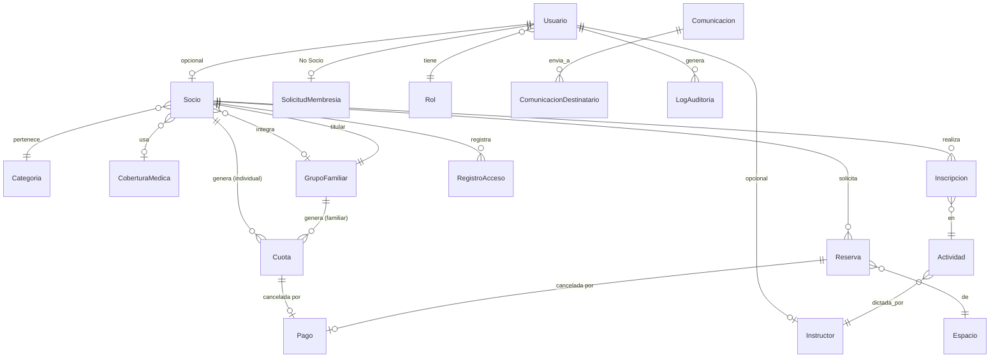

# SPEC.md — Sistema de Gestión Club Atlético Unión (CAU)

**Versión:** 4.0 (Especificación Técnica Consolidada)
**Basado en:** `CAU_Requerimientos_Funcionales_v3.pdf`
**Fecha:** 2026-08-27
**Convención de trazabilidad:** los requerimientos heredados del documento v3 conservan su ID original (`RF-XXX-NN`). Los requerimientos y reglas de negocio nuevos, producto de esta auditoría, se marcan como **[NUEVO-SPEC]**.

---

## 1. Visión General y Alcance

### 1.1 Objetivo del sistema

Sistema de gestión integral para el Club Atlético Unión (CAU), que digitaliza la administración de socios, grupos familiares, actividades, reservas de espacios, cobranza de cuotas, comunicaciones institucionales y control de acceso físico, junto con un portal de autogestión para socios y aspirantes a socio.

### 1.2 Fase 1 — Web (Backoffice + Portal del Socio)

Alcance mínimo viable, desplegado como aplicación web responsive:

- Backoffice administrativo (SuperAdmin, Administrador, Empleado/Secretaría, Instructor).
- Portal del Socio (autogestión).
- Portal público + flujo de Solicitud de Membresía para No Socios.
- Integración de pagos con Mercado Pago.
- Comunicaciones por Email y WhatsApp (vía proveedor de mensajería, ej. Twilio/WhatsApp Business API).
- Control de acceso físico mediante QR (portería).

### 1.3 Fase 2 — App del Socio (fuera de alcance de esta especificación, dejado como visión)

- App móvil nativa/híbrida para el Socio, reutilizando la API REST de Fase 1.
- Notificaciones push (vencimientos, confirmaciones, comunicados).
- Carnet digital con QR embebido, validable offline por checksum firmado.
- Reserva de canchas deportivas dentro de la app (si el club decide habilitar ese flujo online más adelante — hoy es explícitamente fuera de plataforma, ver RF-RES-28).

### 1.4 Fuera de alcance (ambas fases, salvo decisión futura del club)

- Pagos parciales / financiación en cuotas de una misma cuota social (**[NUEVO-SPEC]**, ver §3.8).
- Multi-sede / multi-club (tenant único).
- Facturación electrónica / integración AFIP (se emite comprobante interno, no factura fiscal).

---

## 2. Roles y Modelo de Acceso (RBAC)

### 2.1 Roles del sistema

Se extiende el esquema original de 4 roles (RF-LOG-01) a **6 roles**, incorporando Empleado/Secretaría e Instructor como usuarios con login propio **[NUEVO-SPEC]**:

| Rol | Origen | Descripción |
|---|---|---|
| **SuperAdministrador** | RF-LOG-01 | Control total, incluida la gestión de usuarios administrativos y Configuración. |
| **Administrador** | RF-LOG-01 | Todas las funcionalidades administrativas, excepto administración de usuarios administradores y Configuración crítica. |
| **Empleado / Secretaría** | **[NUEVO-SPEC]** | Rol operativo diario: atención al socio, cobranza, reservas, comunicaciones y portería (control de acceso). Sin visibilidad de reportes financieros consolidados ni Configuración. |
| **Instructor** | **[NUEVO-SPEC]** | Usuario con login propio, acceso a un mini-portal donde ve únicamente las actividades que tiene asignadas y sus inscriptos. No accede a datos financieros ni de otros socios fuera de sus actividades. |
| **Socio** | RF-LOG-01 | Portal del Socio únicamente. |
| **No Socio** | RF-LOG-01 | Páginas públicas + solicitud de membresía y su seguimiento. |

**Regla de implementación [NUEVO-SPEC]:** los 6 roles son entidades de datos (`Rol`), no valores hardcodeados, para sostener RF-CONF-08/RF-CONF-09 (el SuperAdmin puede crear roles adicionales y ajustar permisos finos por `Permiso`).

### 2.2 Matriz de permisos por módulo

Convención: **C**=Crear · **L**=Leer · **M**=Modificar · **B**=Baja lógica · **—**=Sin acceso · **Propio**=Solo sobre sus propios registros

| Módulo | SuperAdmin | Administrador | Empleado/Secretaría | Instructor | Socio | No Socio |
|---|:---:|:---:|:---:|:---:|:---:|:---:|
| Socios (ABM) | CLMB | CLMB | CLM (sin B) | — | Propio (L, M parcial) | — |
| Grupos Familiares | CLMB | CLMB | CLM (sin B) | — | Propio (L) | — |
| Actividades (ABM) | CLMB | CLMB | CLM (sin B) | L (propias) | L | L (público) |
| Inscripciones a Actividades | CLMB | CLMB | CLMB | L (propias, sin editar) | Propio (C/B) | — |
| Espacios (ABM) | CLMB | CLMB | L | — | L | L (público) |
| Reservas | CLMB | CLMB | CLMB | — | Propio (C/L/B) | — |
| Comunicaciones (crear/enviar) | CLMB | CLMB | CLM (sin eliminar) | — | L (recibidas) | — |
| Finanzas — Cuotas/Pagos | CLMB | CLMB | C (registrar pago manual), L | — | Propio (L, pagar) | — |
| Finanzas — Reportes/Dashboard | L | L | — | — | — | — |
| Control de Acceso (QR) | CLMB | CLMB | CL (operar portería) | — | — | — |
| Solicitudes de Membresía | CLMB | CLMB | CL (revisar, sin aprobar/rechazar\*) | — | — | Propio (C/L) |
| Reportes generales | CLMB | CL | — | — | — | — |
| Configuración General | CLMB | — | — | — | — | — |
| Gestión de Usuarios Admin | CLMB | — | — | — | — | — |
| Gestión de Roles/Permisos | CLMB | — | — | — | — | — |
| Coberturas Médicas / Categorías | CLMB | CLMB | L | — | — | — |

\* **[NUEVO-SPEC]** Empleado puede pre-revisar y adjuntar observaciones a una solicitud de membresía, pero la aprobación/rechazo final (que da de alta a un Socio) requiere Administrador o SuperAdmin — es una acción irreversible con impacto en facturación.

**Regla transversal [NUEVO-SPEC]:** ningún rol distinto de SuperAdministrador/Administrador puede ver la Ficha Médica completa de un socio (observaciones clínicas, grupo sanguíneo, cobertura). Empleado e Instructor solo ven el **estado de vigencia** (Vigente/Próxima a vencer/Vencida) — ver §3.12 (dato sensible, Ley 25.326).

---

## 3. Auditoría de Requerimientos: Casos Borde y Reglas de Negocio Nuevas

El documento v3 ya resuelve varios huecos críticos (ficha médica con vencimiento, motivo de baja trazable, exclusividad de titular en grupo familiar, canchas no reservables online, exclusividad Cuota/Reserva en Pago). Esta auditoría cubre lo que **v3 todavía no define**.

### 3.1 [NUEVO-SPEC] Control de acceso físico por QR

No existe ningún requerimiento sobre control de acceso, pese a ser mencionado explícitamente como necesidad del club.

**Módulo nuevo: Control de Acceso**
- RN-ACC-01: Cada Socio y cada integrante de un Grupo Familiar posee un código QR único e inmutable, embebido en su Carnet Digital (RF-SOC-34/RF-PS-10).
- RN-ACC-02: Al escanear el QR en portería, el sistema valida en este orden: (1) Socio existe y no está dado de baja físicamente eliminado; (2) Estado del Socio (Activo/Suspendido/Inactivo); (3) Estado de la cuota (no Vencida más allá de la tolerancia parametrizada); (4) Vigencia de la Ficha Médica (RF-SOC-04 ter/quater).
- RN-ACC-03: Si alguna validación falla, el sistema deniega el acceso, muestra el motivo específico al operador de portería (Empleado) y registra el intento en `RegistroAcceso`.
- RN-ACC-04: Si todas las validaciones pasan, el sistema registra el ingreso (fecha/hora) y muestra en pantalla la foto y el nombre del socio, para verificación visual por el operador (evita el préstamo de carnets entre socios).
- RN-ACC-05: El QR no debe contener datos sensibles en claro — solo un identificador opaco firmado (JWT corto o token aleatorio) que el backend resuelve contra la base de datos.

### 3.2 Definición de "Moroso": ¿estado del socio o del pago?

El documento es inconsistente: RF-SOC-26 define los estados del Socio como *Activo / Suspendido / Inactivo* (sin "Moroso"), pero RF-INI-03 y RF-SOC-24 usan "socios morosos" como indicador, como si fuera un estado propio.

- **RN-FIN-01 [NUEVO-SPEC]:** "Moroso" **no es un estado del Socio**, es un estado derivado y calculado a partir de sus Cuotas: un socio es "moroso" si tiene al menos una Cuota en estado `Vencida`. Los indicadores de "socios morosos" son consultas filtradas, no un campo persistido en `Socio`.
- **RN-FIN-02 [NUEVO-SPEC]:** Suspensión automática por mora prolongada — cuando la mora supera el parámetro `MaximaDeudaEnMeses` (ya previsto en RF-CONF-01 nota), el sistema debe cambiar automáticamente el estado del Socio de `Activo` a `Suspendido` mediante un job diario, notificando al socio (RF-COM-26) y al administrador. La reactivación tras regularizar el pago **no es automática**: requiere confirmación del Administrador/Empleado (evita reactivar por errores de conciliación de Mercado Pago).

### 3.3 Reactivación de Socio (falta el simétrico de la baja)

RF-GF-23 permite reactivar un Grupo Familiar dado de baja, pero no existe el equivalente para un Socio individual.

- **RN-SOC-01 [NUEVO-SPEC]:** El sistema debe permitir reactivar un Socio en estado `Suspendido` o `Inactivo`, validando previamente: ficha médica vigente (o solicitándola en el mismo flujo) y definiendo qué ocurre con la deuda histórica (se mantiene visible, no se condona).

### 3.4 Sucesión de titularidad en Grupo Familiar

RF-GF-04 bis exige que el titular integre el grupo, pero no define qué pasa si el titular causa baja individual mientras el grupo sigue activo.

- **RN-GF-01 [NUEVO-SPEC]:** El sistema debe impedir la baja lógica de un Socio que sea titular de un Grupo Familiar activo, salvo que se ejecute uno de estos dos flujos en el mismo proceso: (a) reasignar la titularidad a otro integrante del grupo, o (b) dar de baja el grupo familiar completo. La cuota familiar (RF-GF-04 bis) siempre se re-emite a nombre del titular vigente.

### 3.5 Cálculo de la cuota de un Grupo Familiar

RF-FIN-09 dice que el importe "se calcula según la categoría del socio o grupo familiar", sin definir la fórmula.

- **RN-FIN-03 [NUEVO-SPEC]:** Se define un parámetro de Configuración `TipoTarifaFamiliar` con dos modos posibles: `TarifaPlanaGrupo` (un único importe fijo por grupo, independiente de la cantidad de integrantes) o `SumaCategoriasIndividuales` (se suma el valor de cuota de la categoría de cada integrante). El club elige el modo vigente; ambos deben poder convivir históricamente sobre cuotas ya emitidas.

### 3.6 Cambio de tipo de pago a mitad de período

RF-SOC-02 permite cambiar el tipo de pago (mensual/semestral/anual/estudiante) "a su preferencia", sin definir el efecto sobre cuotas ya generadas.

- **RN-FIN-04 [NUEVO-SPEC]:** Un cambio de `TipoPago` solo aplica a partir del próximo período a emitir; nunca modifica retroactivamente cuotas ya generadas (pagadas, pendientes o vencidas). El sistema debe recalcular la fecha del próximo vencimiento en función del nuevo tipo de pago.

### 3.7 Conflicto de horarios al inscribirse a actividades

No hay validación de superposición horaria entre actividades para un mismo socio (sí existe para reservas de espacios, RF-RES-09).

- **RN-ACT-01 [NUEVO-SPEC]:** El sistema no debe bloquear la inscripción a actividades con horarios superpuestos (la decisión de asistir es del socio), pero debe advertir visualmente el conflicto antes de confirmar la inscripción.

### 3.8 Pagos parciales / cuotas en cuotas

RF-FIN-14 modela un `Importe` único por pago; no contempla financiar una cuota en varios pagos parciales.

- **RN-FIN-05 [NUEVO-SPEC — decisión de alcance]:** Fase 1 no soporta pagos parciales de una misma Cuota. Un Pago cancela una Cuota completa o no la afecta. Si el club necesita planes de pago, se aborda como cambio de alcance en una fase posterior (requiere modelar `PlanDePago` con cuotas propias).

### 3.9 Cancelación de reservas y reembolsos

RF-PS-ALQ-15 permite cancelar "según las políticas del club", pero no define esas políticas ni qué pasa con el dinero ya pagado (RF-PS-ALQ-12).

- **RN-RES-01 [NUEVO-SPEC]:** Cada Espacio define `PoliticaCancelacionHoras` (antelación mínima en horas) y `PorcentajeReembolso`. Al cancelar una reserva `Pagada` dentro del plazo permitido, el sistema genera un registro de reembolso pendiente (fuera de la plataforma de pago, gestionado manualmente por Finanzas, ya que Mercado Pago requiere una operación de devolución explícita vía su API).

### 3.10 Política de contraseñas concreta

RF-LOG-18 remite a "los requisitos mínimos de seguridad definidos por la institución" sin especificarlos.

- **RN-LOG-01 [NUEVO-SPEC]:** Mínimo 8 caracteres, al menos una mayúscula, una minúscula y un número. Configurable desde Configuración General (SuperAdmin) para no hardcodear la política.

### 3.11 Auditoría genérica (RG-06) sin modelo concreto

RG-06 exige registrar acciones de usuarios "cuando correspondan", sin entidad ni criterio de qué se audita.

- **RN-AUD-01 [NUEVO-SPEC]:** Se define la entidad `LogAuditoria`, poblada automáticamente vía interceptor de EF Core (`SaveChangesInterceptor`) para toda operación de Alta/Modificación/Baja sobre: Socio, GrupoFamiliar, Cuota, Pago, Actividad, Reserva, Usuario y Configuración. Se excluyen entidades de solo lectura o cachés (ej. indicadores calculados).

### 3.12 Datos sensibles y Habeas Data (Ley 25.326 – Argentina)

La ficha médica del socio (RF-SOC-04) incluye cobertura, grupo sanguíneo y observaciones clínicas: son datos sensibles bajo la legislación argentina de protección de datos personales.

- **RN-SEG-01 [NUEVO-SPEC]:** Las columnas de datos médicos se cifran en reposo (`Always Encrypted` en SQL Server o cifrado a nivel de aplicación). El alta de un socio debe registrar el consentimiento informado para el tratamiento de datos de salud. El acceso de lectura a la ficha médica completa queda restringido a SuperAdmin/Administrador (ver matriz §2.2); el resto de los roles solo ve el semáforo de vigencia.

### 3.13 Unicidad de DNI y correo electrónico

RG-07 exige evitar duplicados "cuando corresponda", sin nombrar los campos.

- **RN-SOC-02 [NUEVO-SPEC]:** `DNI` y `Email` son únicos a nivel de base de datos dentro de la tabla `Socio`, y `Email`/`NombreUsuario` son únicos dentro de `Usuario`. RF-SOL-04 ya exige esta validación cruzada contra solicitudes pendientes; se extiende como constraint físico, no solo validación de aplicación.

### 3.14 Almacenamiento de archivos adjuntos

RF-SOL-05 exige adjuntar foto, documento y ficha médica; RF-SOC-05/RF-ACT-03/RF-RES-03 requieren imágenes.

- **RN-INF-01 [NUEVO-SPEC]:** Ningún archivo binario se almacena en la base de datos relacional. Se usa almacenamiento de objetos (Azure Blob Storage / S3-compatible) y la base de datos guarda únicamente la URL/clave del objeto.

### 3.15 Multiplicidad "titular sin cuenta de usuario" en cuota familiar

Al pagar una cuota familiar (RF-GF-04 bis), la cuota se emite a nombre del titular, pero cada integrante puede tener su propio login de Socio (según RF-LOG-05). Debe aclararse quién ve y paga esa cuota.

- **RN-FIN-06 [NUEVO-SPEC]:** La Cuota de un Grupo Familiar es visible en el Portal del Socio de **todos** los integrantes con cuenta propia (en modo solo lectura para no titulares), pero solo el **titular** puede iniciar el pago desde su portal. Empleado/Administrador pueden registrar el pago manualmente sin esta restricción.

---

## 4. Modelo de Datos

### 4.1 Diagrama entidad-relación (resumen)

### 4.2 Entidades y atributos principales

**Usuario** (autenticación, independiente del rol de negocio)
`Id, NombreUsuario, Email, PasswordHash, RolId (FK Rol), Estado, RecordarSesionToken, FechaCreacion, FechaUltimoAcceso`

**Rol** / **Permiso** / **RolPermiso** (RBAC dinámico, RF-CONF-08/09)
`Rol(Id, Nombre, EsRolDeSistema)`, `Permiso(Id, Codigo, Descripcion, Modulo)`, `RolPermiso(RolId, PermisoId)`

**Socio**
`Id, UsuarioId (FK), NumeroSocio (autogenerado), Apellido, Nombres, DNI (UNIQUE), CUIL, FechaNacimiento, Genero, Nacionalidad, TipoPago, CategoriaId (FK), Telefono, Celular, Email (UNIQUE), Domicilio, Localidad, Provincia, CodigoPostal, CoberturaMedicaId (FK), GrupoSanguineo [cifrado], ContactoEmergencia, ObservacionesMedicas [cifrado], FichaMedicaFechaEmision, FichaMedicaFechaVencimiento (calculado = Emision + 1 año), FotoUrl, GrupoFamiliarId (FK, nullable), Estado (Activo/Suspendido/Inactivo), FechaAlta, FechaBaja, MotivoBaja, FechaUltimaModificacion`

**GrupoFamiliar**
`Id, TitularSocioId (FK Socio, UNIQUE), Estado, Observaciones, FechaCreacion, FechaBaja`

**Categoria**
`Id, Nombre, Descripcion, ValorCuota, Estado`

**CoberturaMedica**
`Id, Nombre, Descripcion, Estado`

**Instructor** **[NUEVO-SPEC]**
`Id, UsuarioId (FK), Apellido, Nombres, DNI, Telefono, Email, Especialidad, Estado`

**Actividad**
`Id, Nombre, Descripcion, CategoriaId (FK), InstructorId (FK, NOT NULL si Estado=Activa — RN RF-ACT-24 bis), CupoMinimo, CupoMaximo, Dias, HorarioInicio, HorarioFin, Duracion, Estado (Activa/Suspendida/Finalizada), ImagenUrl, FechaUltimaModificacion`

**Inscripcion**
`Id, SocioId (FK), ActividadId (FK), FechaInscripcion, Estado (Activa/Cancelada)`
Constraint: (SocioId, ActividadId) único mientras Estado=Activa.

**Espacio**
`Id, Nombre, Descripcion, Ubicacion, Tipo (Salon/CanchaDeportiva/Otro — RF-RES-27), Capacidad, Precio, Estado, ImagenUrl, PoliticaCancelacionHoras [NUEVO-SPEC], PorcentajeReembolso [NUEVO-SPEC]`

**Reserva**
`Id, SocioId (FK), EspacioId (FK), Fecha, HoraInicio, HoraFin, Duracion, Estado (PendienteConfirmacion/Confirmada/Rechazada/Pagada/Cancelada), MotivoRechazo, FechaCreacion`
Constraint: no puede existir otra Reserva con Estado en (Confirmada, PendienteConfirmacion) para el mismo (EspacioId, Fecha, Horario) — RF-RES-09 bis.

**Cuota**
`Id, SocioId (FK, nullable), GrupoFamiliarId (FK, nullable — exactamente uno de los dos no nulo), NumeroCuota, Periodo, FechaVencimiento, Importe, Estado (Pendiente/Pagada/Vencida)`

**Pago**
`Id, SocioId (FK), CuotaId (FK, nullable), ReservaId (FK, nullable — CHECK: exactamente uno no nulo, RF-FIN-34), Fecha, Importe, MedioPago, Estado, MercadoPagoTransaccionId, ComprobanteUrl`

**SolicitudMembresia**
`Id, UsuarioId (FK, rol No Socio), NumeroSolicitud, Nombre, Apellido, DNI (UNIQUE dentro de solicitudes activas), FechaNacimiento, Email, Telefono, Domicilio, DocumentoIdentidadUrl, FichaMedicaUrl, Estado (Pendiente/Aprobada/Rechazada), MotivoRechazo, FechaSolicitud`

**Comunicacion**
`Id, Asunto, Descripcion, ContenidoHtml, TipoComunicacion, Estado, CreadoPorUsuarioId (FK), FechaCreacion, FechaUltimoEnvio`

**ComunicacionDestinatario**
`Id, ComunicacionId (FK), UsuarioId (FK), Canal (Email/WhatsApp), EstadoEnvio, FechaEnvio, FechaLectura`

**RegistroAcceso** **[NUEVO-SPEC]**
`Id, SocioId (FK), FechaHora, Resultado (Permitido/Denegado), MotivoDenegacion, OperadorUsuarioId (FK)`

**LogAuditoria** **[NUEVO-SPEC]**
`Id, UsuarioId (FK), Entidad, EntidadId, Accion (Alta/Modificacion/Baja), FechaHora, ValoresJson`

---

## 5. Mapeo de Endpoints de la API (REST)

Convención: todos los endpoints administrativos bajo `/api/*`, los del Portal del Socio bajo `/api/me/*` (resuelven el `SocioId` desde el token, evitando exponer IDs de terceros).

### Autenticación
- `POST /api/auth/login`
- `POST /api/auth/logout`
- `POST /api/auth/forgot-password`
- `POST /api/auth/reset-password`

### Socios
- `GET /api/socios` (filtros: nombre, DNI, categoría, estado, actividad; paginado)
- `POST /api/socios`
- `GET /api/socios/{id}`
- `PUT /api/socios/{id}`
- `POST /api/socios/{id}/baja`
- `POST /api/socios/{id}/reactivar` **[NUEVO-SPEC]**
- `PUT /api/socios/{id}/estado`
- `GET /api/socios/{id}/carnet` (PDF)
- `GET /api/socios/export` (pdf|xlsx)

### Grupos Familiares
- `GET /api/grupos-familiares`
- `POST /api/grupos-familiares`
- `GET /api/grupos-familiares/{id}`
- `PUT /api/grupos-familiares/{id}`
- `POST /api/grupos-familiares/{id}/integrantes`
- `DELETE /api/grupos-familiares/{id}/integrantes/{socioId}`
- `POST /api/grupos-familiares/{id}/cambiar-titular` **[NUEVO-SPEC]**
- `POST /api/grupos-familiares/{id}/baja`
- `POST /api/grupos-familiares/{id}/reactivar`

### Actividades
- `GET /api/actividades`
- `POST /api/actividades`
- `GET /api/actividades/{id}`
- `PUT /api/actividades/{id}`
- `POST /api/actividades/{id}/baja`
- `GET /api/actividades/{id}/inscriptos`
- `POST /api/actividades/{id}/inscripciones`
- `DELETE /api/actividades/{id}/inscripciones/{socioId}`

### Espacios y Reservas
- `GET /api/espacios`
- `POST /api/espacios`
- `PUT /api/espacios/{id}`
- `GET /api/espacios/{id}/disponibilidad?fecha=`
- `GET /api/reservas` (calendario, filtros)
- `POST /api/reservas`
- `PUT /api/reservas/{id}`
- `POST /api/reservas/{id}/confirmar`
- `POST /api/reservas/{id}/rechazar`
- `POST /api/reservas/{id}/cancelar`

### Finanzas
- `GET /api/cuotas`
- `POST /api/cuotas/generar-periodo` (batch mensual/anual)
- `GET /api/pagos`
- `POST /api/pagos` (manual)
- `POST /api/pagos/mercadopago/checkout`
- `POST /api/pagos/mercadopago/webhook`
- `GET /api/pagos/{id}/comprobante`
- `GET /api/finanzas/dashboard`
- `GET /api/finanzas/reportes/ingresos`

### Comunicaciones
- `GET /api/comunicaciones`
- `POST /api/comunicaciones`
- `PUT /api/comunicaciones/{id}`
- `DELETE /api/comunicaciones/{id}`
- `POST /api/comunicaciones/{id}/enviar`
- `GET /api/comunicaciones/{id}/trazabilidad`

### Control de Acceso **[NUEVO-SPEC]**
- `POST /api/control-acceso/validar` (recibe token QR, devuelve permitido/denegado + motivo)
- `GET /api/control-acceso/historial?socioId=`

### Solicitudes de Membresía
- `POST /api/solicitudes-membresia` (público)
- `GET /api/solicitudes-membresia/{id}/seguimiento` (No Socio autenticado)
- `GET /api/solicitudes-membresia` (admin)
- `POST /api/solicitudes-membresia/{id}/aprobar`
- `POST /api/solicitudes-membresia/{id}/rechazar`

### Configuración
- `GET/PUT /api/configuracion/general`
- `CRUD /api/configuracion/usuarios`
- `CRUD /api/configuracion/roles`
- `CRUD /api/configuracion/coberturas-medicas`
- `CRUD /api/configuracion/categorias`

### Portal del Socio (`/api/me/*`)
- `GET /api/me/perfil` · `PUT /api/me/perfil` · `PUT /api/me/password`
- `GET /api/me/carnet`
- `GET /api/me/actividades` · `POST /api/me/actividades/{id}/inscribirme` · `DELETE /api/me/actividades/{id}/inscripcion`
- `GET /api/me/reservas` · `POST /api/me/reservas` · `DELETE /api/me/reservas/{id}`
- `GET /api/me/cuotas` · `POST /api/me/cuotas/{id}/pagar`
- `GET /api/me/comunicaciones`
- `GET /api/me/notificaciones`

### Portal del Instructor **[NUEVO-SPEC]**
- `GET /api/instructor/actividades` (solo las propias)
- `GET /api/instructor/actividades/{id}/inscriptos`

---

## 6. Plan de Implementación por Fases

### Etapa 0 — Infraestructura y Autenticación
- [ ] Proyecto .NET (API) + EF Core + base de datos SQL Server
- [ ] Modelo `Usuario`/`Rol`/`Permiso` con RBAC dinámico
- [ ] Login, recuperación de contraseña, política de contraseñas (RN-LOG-01)
- [ ] Middleware de autorización por permiso (no solo por rol)
- [ ] `LogAuditoria` vía interceptor EF Core (RN-AUD-01)
- [ ] Almacenamiento de objetos (Blob Storage) configurado

### Etapa 1 — Socios, Grupos Familiares y Configuración base
- [ ] ABM de Socios + ficha médica con vencimiento (RF-SOC-04 ter/quater)
- [ ] Baja lógica con motivo (RF-SOC-12 bis) y reactivación (RN-SOC-01)
- [ ] Grupos Familiares + regla de titularidad (RF-GF-04 bis, RN-GF-01)
- [ ] Categorías, Coberturas Médicas
- [ ] Cifrado de datos médicos sensibles (RN-SEG-01)
- [ ] Carnet digital + generación de QR (base para Etapa 5)

### Etapa 2 — Actividades y Reservas
- [ ] ABM de Actividades + validación de instructor obligatorio (RF-ACT-24 bis)
- [ ] Inscripciones + control de cupo + aviso de superposición horaria (RN-ACT-01)
- [ ] Rol Instructor + mini-portal (RF nuevos §2, §5)
- [ ] ABM de Espacios con clasificación Salón/Cancha (RF-RES-27/28)
- [ ] Reservas con calendario y anti-superposición (RF-RES-09 bis)
- [ ] Flujo de solicitud de salón desde Portal del Socio (RF-PS-ALQ-*)

### Etapa 3 — Finanzas
- [ ] Generación batch de Cuotas por período (individuales y familiares, RN-FIN-03)
- [ ] Registro de pagos manuales + exclusividad Cuota/Reserva (RF-FIN-34)
- [ ] Integración Mercado Pago (checkout + webhook)
- [ ] Suspensión automática por mora (RN-FIN-02) — job diario
- [ ] Reembolsos de reservas canceladas (RN-RES-01)
- [ ] Dashboard financiero y reportes

### Etapa 4 — Comunicaciones y Notificaciones
- [ ] Editor de comunicaciones + destinatarios segmentados
- [ ] Envío por Email y WhatsApp + trazabilidad de lectura (RF-COM-36)
- [ ] Job de cumpleaños (RF-COM-24) y recordatorios de vencimiento (RF-COM-26)
- [ ] Centro de notificaciones en Portal del Socio

### Etapa 5 — Control de Acceso (QR)
- [ ] Emisión de token QR opaco por socio (RN-ACC-05)
- [ ] Endpoint de validación en portería + reglas RN-ACC-02/03/04
- [ ] Historial de accesos y consulta por socio

### Etapa 6 — Solicitudes de Membresía y Portal Público
- [ ] Formulario público + creación de cuenta No Socio
- [ ] Gestión administrativa de solicitudes + conversión a Socio (RF-SOL-13)
- [ ] Seguimiento de estado por el solicitante

### Etapa 7 — Reportes, QA y Hardening
- [ ] Módulo de Reportes (pendiente de definición funcional detallada — hueco heredado de v3, sección 11)
- [ ] Pruebas de carga sobre generación batch de cuotas y webhook de Mercado Pago
- [ ] Revisión de seguridad (OWASP Top 10) sobre endpoints públicos (solicitud de membresía, login)
- [ ] Auditoría de permisos por rol contra la matriz de §2.2

### Fase 2 — App del Socio (visión, no planificada en detalle)
- [ ] Reutilización de `/api/me/*` desde app móvil
- [ ] Notificaciones push
- [ ] QR del carnet embebido y validable offline con firma
